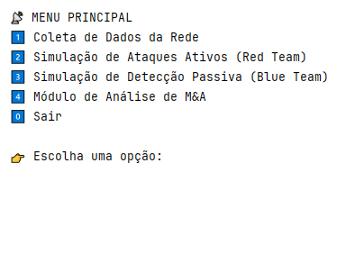
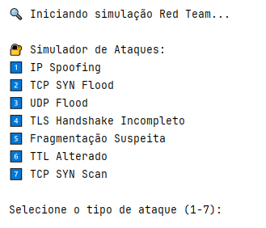
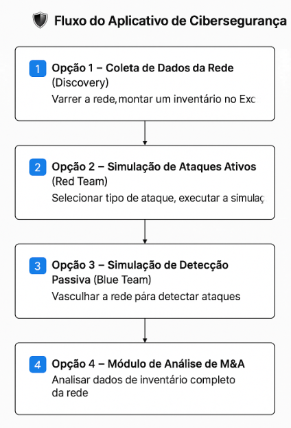
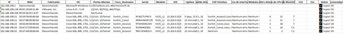
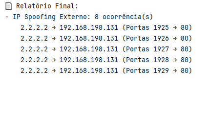
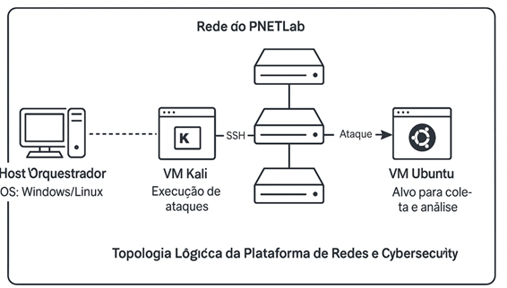

# Cybersecurity Simulation and Predictive Detection Framework

## 📑 Table of Contents
- [📌 Project Overview](#-project-overview)
- [⚙️ Architecture](#️-architecture)
- [🖥️ Implementation Environment](#️-implementation-environment)
- [📊 Results](#-results)
- [🚀 Roadmap (Next Steps)](#-roadmap-next-steps)
- [📂 Repository Structure](#-repository-structure)
- [🔗 Project Modules & Key Files](#-project-modules--key-files)
- [📸 Screenshots](#-screenshots)
- [📝 Academic Validation](#-academic-validation)
- [📜 License](#-license)
- [📧 Contact](#-contact)

---

## 📌 Project Overview
This repository contains the capstone project developed during my **MBA in Cybersecurity & Networking**, successfully defended and approved in 2025.  
The project integrates **Red Team offensive simulations**, **Blue Team defensive monitoring**, and **AI-based anomaly detection** into a modular and replicable framework.  

The system was designed to support:
- **Cybersecurity training and audits**  
- **Mergers & Acquisitions (M&A) network due diligence**  
- **Corporate resilience testing**  

---

## ⚙️ Architecture
The framework is structured into three main modules:

1. **Red Team (Attack Simulation)**  
   - Generates controlled network attacks (IP Spoofing, SYN Flood, DNS Tunneling, TLS Handshake Incomplete).  
   - Executed via Python scripts and hping3 in a Kali Linux environment.  

2. **Blue Team (Traffic Capture & Analysis)**  
   - Uses Wireshark/tshark and Scapy to capture and parse network packets.  
   - Identifies anomalies based on traffic volume, TTL changes, fragmentation, and unusual headers.  

3. **AI/ML Detection**  
   - Implements an **Isolation Forest** model for anomaly detection.  
   - Achieved **>90% accuracy** distinguishing legitimate vs. malicious traffic in controlled tests.  

---

## 🖥️ Implementation Environment
- **Kali Linux VM** (attack execution)  
- **Windows Host with Wireshark/tshark** (traffic capture)  
- **Python (Scapy, Sklearn, Pandas, Matplotlib)**  
- **Streamlit (optional interface prototype)**  

---

## 📊 Results
- Successfully simulated multiple Layer 3 and Layer 7 attacks.  
- Blue Team module correctly flagged anomalies such as spoofed IPs, abnormal user-agents, and incomplete TLS handshakes.  
- Machine Learning model reached **high accuracy in predictive detection**, confirming the potential for enterprise use.  

---

## 🚀 Roadmap (Next Steps)
1. Expand dataset with real corporate network traffic.  
2. Integrate with **SIEM/SOAR tools** for automated response.  
3. Pilot implementation in **M&A due diligence projects** to reduce risk of downtime and cyber incidents.  
4. Extend framework to **critical sectors** (healthcare, finance, logistics).  

---

## 📂 Repository Structure
- `/M&A` → M&A analysis module (menu, inventory, reports)  
- `/Streamlit testes` → Streamlit prototype interfaces and demos  
- `/docs` → Technical reports, PDFs, and MBA defense presentation  

---

## 🔗 Project Modules & Key Files
- [Menu script](https://github.com/Alessandro-HCL/MBA-Cybersecurity/blob/main/M%26A/Menu.py) → Main entrypoint for framework navigation  
- [Red Team script](./M&A/Red_team_ataque_OKAY.py) → Controlled attack simulations (hping3 / Kali)  
- [Blue Team script](./M&A/Blue_team_detecção_OKAY.py) → Passive monitoring & Scapy analysis  
- [Data collection script](./M&A/Coleta_dados-OKAY.py) → Automated Wireshark/tshark capture  
- [Streamlit prototypes](./Streamlit%20testes) → Experimental Streamlit interfaces  
- [Docs folder](./docs) → Reports, MBA defense material, and screenshots  

---

## 📸 Screenshots
Below are selected screenshots stored in [`/docs/screenshots`](./docs/screenshots):

-   
  *Main framework menu showing available modules.*  

-   
  *Submenu for launching controlled Red Team attack simulations.*  

-   
  *High-level workflow of the cybersecurity simulation framework.*  

-   
  *Output showing verification of End-of-Life / End-of-Support devices.*  

-   
  *Terminal output highlighting spoofed IP traffic detection.*  

-   
  *Logical topology of the lab environment modeled in PNETLab.*  

---

## 📝 Academic Validation
This project was **defended and approved** as part of my MBA in Cybersecurity & Networking.  
It demonstrates both **academic merit** and **practical applicability** to real-world U.S. challenges in **cybersecurity and M&A integrations**.  

---

## 📜 License
Released under the **MIT License**. See [LICENSE](./LICENSE).  

---

## 📧 Contact
**Alessandro Moreira** – Senior Network & Cybersecurity Engineer  
- MBA in Artificial Intelligence for Business  
- MBA in Cybersecurity & Networking  
- CCNP Enterprise | Cisco DevNet Certified  
- IEEE Member (2025–2026)  
- GitHub: [Alessandro-HCL](https://github.com/Alessandro-HCL)  
